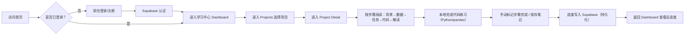

# Python 数据分析实训平台 — PRD（产品需求文档）

## 1. Product Overview
面向大学生群体的免费在线学习平台，通过 10 个完整训练项目（含数据集、代码示例、分析任务与解读练习）帮助用户系统掌握 pandas 数据清洗、预处理、分析与解读能力。
- 目标用户：AI 时代背景下需要掌握数据分析技能的大学生
- 核心价值：项目驱动式学习 + 免费 + 进度持久化（需登录以保存学习记录）

## 2. Core Features

### 2.1 User Roles
| Role | Registration Method | Core Permissions |
|------|---------------------|------------------|
| 学员（注册用户） | 邮箱/密码注册登录（Supabase Auth） | 浏览项目、标记完成、保存学习笔记、查看个人进度 |
| 游客 | 无需注册 | 仅可浏览首页与项目概览，查看受限内容 |

### 2.2 Feature Module
1. **认证模块**：注册、登录、退出（基于 Supabase Auth）
2. **首页（Home）**：平台介绍、学习路径、10 个项目卡片、推荐入口
3. **项目列表页（Projects）**：展示所有 10 个训练项目（含进度徽章）
4. **项目详情页（Project Detail）**：背景介绍、数据集说明、学习目标、步骤任务（数据清洗 → 分析 → 解读）、参考代码、思考题
5. **个人学习中心（Dashboard）**：已完成项目、当前进度、学习笔记、完成度统计
6. **数据集与代码说明**：嵌入项目详情页，指明 CSV / 公开数据源获取方式

### 2.3 Page Details
| Page Name | Module Name | Feature description |
|-----------|-------------|---------------------|
| Login / Register | 认证表单 | 邮箱/密码注册、登录状态持久化、错误提示 |
| Home | Hero + 项目入口 | 平台理念、学习路径、快速进入项目 |
| Projects | 项目网格 | 10 个项目卡片（分类、难度、是否完成） |
| Project Detail | 分步学习 | 项目介绍、数据集下载、任务清单、完成标记、笔记 |
| Dashboard | 学习中心 | 进度百分比、完成列表、学习笔记聚合 |

### 2.4 10 个训练项目内容规划（必须覆盖的核心技术）
| 编号 | 项目名称 | 核心技术 | 业务场景 |
|------|----------|----------|----------|
| P1 | 超市销售数据清洗与探索 | pandas 清洗（缺失值/重复值/异常值）、描述性统计 | 零售数据分析入门 |
| P2 | 电商购物车行为分析 | 购物车转化漏斗、购物车商品分布、放弃率计算 | 电商运营分析 |
| P3 | 学生成绩聚类分析 | K-Means 聚类、特征标准化、聚类结果解读 | 教育数据挖掘 |
| P4 | 用户消费行为 RFM 分析 | RFM 模型、分箱、客户价值分层 | 用户分层运营 |
| P5 | 时间序列销售预测基础 | 滚动窗口、移动平均、同比/环比计算 | 时序分析入门 |
| P6 | 电影评分数据相关性分析 | corr、heatmap 思想（pandas + 文字解读） | 推荐系统基础 |
| P7 | 泰坦尼克生存数据特征工程 | 缺失值处理、特征衍生、分组聚合 | Kaggle 经典 |
| P8 | 订单数据 A/B 测试分析 | 分组统计、假设检验思想、业务解读 | 增长实验 |
| P9 | 商品评论情感基础统计（词频视角） | 文本分词统计、词频、正负样本分布 | NLP 入门 |
| P10 | 综合案例：城市共享单车数据洞察 | 综合清洗 + 聚合 + 分群 + 解读报告 | 综合项目 |

**技术覆盖矩阵：**
- ✅ pandas 数据清洗（缺失/重复/异常/类型转换）→ P1、P2、P7、P10
- ✅ 数据分析与解读（聚合/分组/对比/趋势）→ P1、P2、P4、P5、P8、P10
- ✅ 购物车分析 → P2
- ✅ 聚类分析 → P3、P10
- ✅ 其他常见分析技术（RFM、时序相关性、A/B、特征工程）→ P4-P9

## 3. Core Process

## 4. User Interface Design

### 4.1 Design Style
- **主题色**：深空蓝 `#0B2545`（主色）、琥珀金 `#E8A33D`（强调色）、浅灰蓝 `#D6E1F0`（中性）
- **配色氛围**：理性、学术、现代感，适合"大学课堂实训"场景
- **按钮风格**：圆角 pill、hover 上浮、强调色填充
- **字体**：标题使用「DM Serif Display」（优雅衬线） + 正文「JetBrains Mono / ui-sans-serif」（代码友好）
- **布局**：顶部导航 + 卡片网格（项目页） + 时间轴式步骤（项目详情）
- **Icon**：lucide-react
- **动效**：滚动淡入、卡片 hover 投影、步骤时间轴

### 4.2 Page Design Overview
| Page Name | Module Name | UI Elements |
|-----------|-------------|-------------|
| Home | Hero | 大标题 + 副文案 + CTA 按钮 + 背景几何图 |
| Home | Projects 推荐 | 3 张精选项目卡片横排 |
| Projects | 卡片网格 | 10 个项目卡片（颜色按技术分类，含进度徽章） |
| Project Detail | 时间轴 | 左侧步骤清单 + 右侧内容面板 |
| Project Detail | 代码片段 | 带行号的代码卡片（纯展示） |
| Dashboard | 统计卡 | 完成度百分比、最近访问项目、笔记卡片 |
| Login | 表单 | 居中卡片、品牌色按钮、错误提示 |

### 4.3 Responsiveness
- 桌面端优先（1280px+），项目详情采用双栏布局
- 平板（768px）：双栏 → 单栏堆叠
- 移动端（< 640px）：顶部导航收起为汉堡菜单，卡片自适应单列
