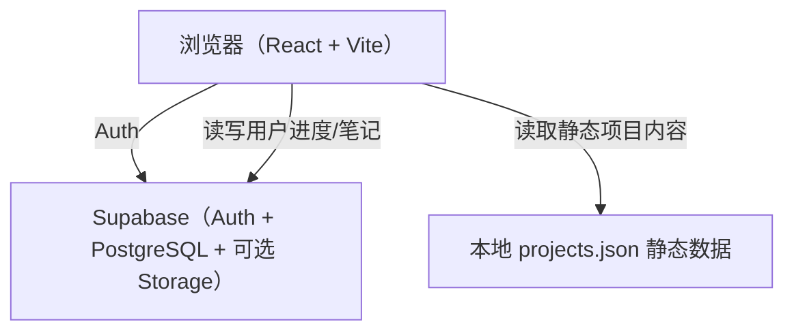
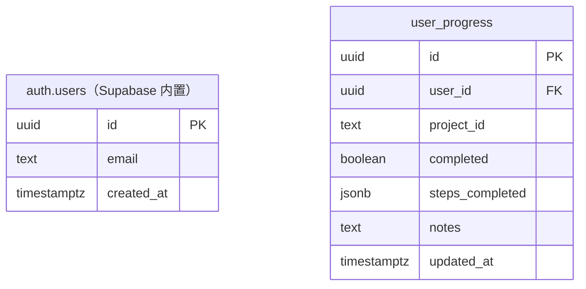

# Python 数据分析实训平台 — 技术架构文档

## 1. Architecture Design



## 2. Technology Description
- **Frontend**: React 18 + TypeScript + React Router DOM + Tailwind CSS 3 + Zustand（轻量状态）
- **Initialization**: `pnpm create vite-init@latest . --template react-ts`
- **Backend / 数据层**: Supabase（承担 Auth、PostgreSQL 数据库；静态项目内容直接存前端 JSON，无需 CMS）
- **不引入独立 Express 后端**：项目内容为只读课程资料，存前端；仅用户进度/笔记走 Supabase

## 3. Route Definitions
| Route | Purpose | 权限 |
|-------|---------|------|
| `/` | 首页 | 公开 |
| `/projects` | 项目列表 | 公开（完成徽章需登录） |
| `/projects/:id` | 项目详情（含步骤、代码、完成标记） | 需登录 |
| `/dashboard` | 个人学习中心（进度、笔记） | 需登录 |
| `/login` | 登录/注册 | 公开 |

## 4. Data Model

### 4.1 Data Model Definition



说明：`auth.users` 由 Supabase Auth 自动管理；`user_progress` 为业务表，一个 user 对一个 project 有一条记录（upsert）。

### 4.2 DDL（Supabase Migration）

```sql
CREATE TABLE IF NOT EXISTS user_progress (
    id uuid PRIMARY KEY DEFAULT gen_random_uuid(),
    user_id uuid NOT NULL REFERENCES auth.users(id) ON DELETE CASCADE,
    project_id text NOT NULL,
    completed boolean DEFAULT false,
    steps_completed jsonb DEFAULT '[]'::jsonb,
    notes text DEFAULT '',
    updated_at timestamptz DEFAULT now(),
    UNIQUE (user_id, project_id)
);

ALTER TABLE user_progress ENABLE ROW LEVEL SECURITY;

CREATE POLICY "users_read_own_progress"
    ON user_progress FOR SELECT
    USING (auth.uid() = user_id);

CREATE POLICY "users_write_own_progress"
    ON user_progress FOR INSERT
    WITH CHECK (auth.uid() = user_id);

CREATE POLICY "users_update_own_progress"
    ON user_progress FOR UPDATE
    USING (auth.uid() = user_id);

CREATE POLICY "users_delete_own_progress"
    ON user_progress FOR DELETE
    USING (auth.uid() = user_id);

GRANT SELECT, INSERT, UPDATE, DELETE ON TABLE user_progress TO authenticated;
```

### 4.3 前端静态项目数据（`src/data/projects.ts`）

```ts
export interface ProjectStep {
  id: string;
  title: string;
  description: string;
  codeHint?: string; // Python 示例代码（纯展示）
  question?: string;  // 思考题
}

export interface Project {
  id: string;           // e.g. "p1"
  title: string;        // 项目名称
  category: string;     // 数据清洗 / 购物车分析 / 聚类 / RFM / 时序...
  difficulty: "入门" | "进阶" | "综合";
  summary: string;      // 项目简介
  datasetUrl: string;   // 数据集来源说明链接（如 Kaggle / UCI）
  techTags: string[];   // 技术标签
  objective: string[];  // 学习目标
  steps: ProjectStep[]; // 步骤清单
}
```

10 个项目的完整条目将写入 `src/data/projects.ts`（无需后端，仅静态展示）。

## 5. 前端目录结构

```
src/
├── main.tsx
├── App.tsx                // 路由
├── pages/
│   ├── Home.tsx
│   ├── Projects.tsx
│   ├── ProjectDetail.tsx
│   ├── Dashboard.tsx
│   └── Login.tsx
├── components/
│   ├── Navbar.tsx
│   ├── ProtectedRoute.tsx
│   ├── ProjectCard.tsx
│   ├── StepTimeline.tsx
│   ├── CodeBlock.tsx
│   └── ProgressBadge.tsx
├── data/projects.ts       // 10 个项目静态内容
├── store/authStore.ts     // zustand 登录态
├── lib/supabase.ts        // Supabase 客户端
└── utils/format.ts
```

## 6. 第三方依赖（关键）
- `@supabase/supabase-js`
- `lucide-react`
- `react-router-dom`
- `zustand`

## 7. 关键交互流程
1. 登录：调用 `supabase.auth.signInWithPassword` 或 `signUp`，成功后写入 zustand，跳转 `/dashboard`
2. 读取进度：`SELECT * FROM user_progress WHERE user_id = auth.uid()`
3. 标记完成：upsert `user_progress`（`completed`、`steps_completed`、`notes`）
4. 未登录访问受保护页：`ProtectedRoute` 重定向 `/login`

## 8. 安全性与 RLS
- `user_progress` 启用 RLS，仅 `authenticated` 角色可操作自己的行
- Supabase `ANON_KEY` 存前端（.env.local），`SUPABASE_URL` 同
- 不使用 `SERVICE_ROLE` 于前端

## 9. Supabase 环境变量
- `VITE_SUPABASE_URL`
- `VITE_SUPABASE_ANON_KEY`

项目初始化后生成 `.env.example` 供用户填入自己的 Supabase 实例。
